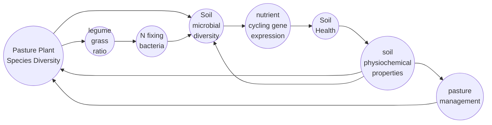

# Here is the Level 1 header

## This marks the start of the formatting section 

### And another header

#### and again

##### and another

###### one last one

#### unordered lists

* one
* two 
* three


#### ordered list

1. a

2. b

3. c

   

#### Manual line breaks

some text,  

and some more  

to display line breaks


#### Links

[My blog](https://greenandglutenfree.com/)


#### Block Quotes

any time something is too hot my partner says:

> " Hot, Hot, Hot Chocolate!"

In Tom hanks voice because I am obsessed with the hot chocolate scene in the polar express


#### Plain code blocks

```
We can just put some text in here and select a language 
```


#### R code blocks

```{r}
bmk <- seq(5,9,1996)
```


#### In line blocks

###### plain text

with this we can just indicate that a chunk of text is `special `

###### r code

with this we can show some R code `{r} View(b)`

#### In Line LaTeX equation

Here is an equation $bmk = S*E + 5996$

#### Centered LaTeX equation


And one that is not in line  
$$
bmk = S*E + 5996 
$$


#### Horizontal Line

here is a line between 

___

two sentence fragments


#### Simple Table

| First Name | Nick Name      |
| ---------- | -------------- |
| Bailey     | B              |
| Jason      | *Jason Derulo* |

#### Highlighted text

Savannah ==Georgia== Mosby ==Bubbles==


### Here is a picture of my flow chart

I want to understand how pasture plant species diversity impacts soil microbial diversity and in turn soil health and function. This is process is part of a feedback loop as you can see below.


Below I convert this to a mermaid flow chart.



